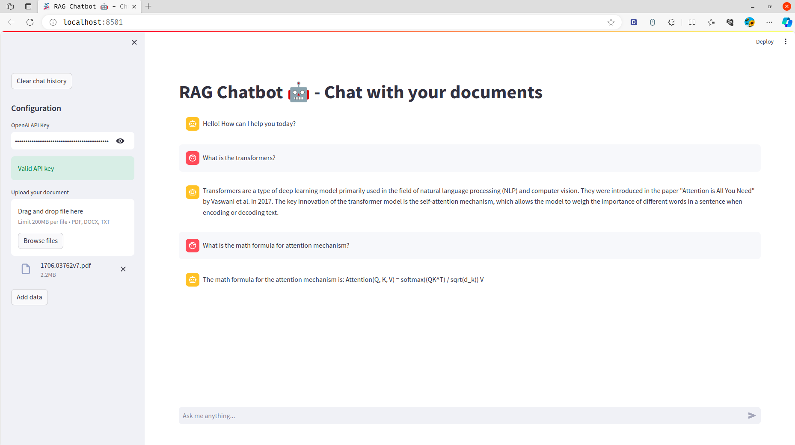

# RAG - ChatBot with Langchain

Retrieval Augmented Generation (RAG) offers a solution to the problem of hallucination in natural language processing. RAG tackles this issue by merging the generative capabilities of language models with an external knowledge retrieval process. Before generating a response, RAG first searches a database of documents, retrieves pertinent information, and then feeds it to the language models. This method enhances the language models' internal knowledge with external, verifiable sources.

LangChain is a framework designed for creating applications that use large language models (LLMs) for power.

In this project, I will show you how to build a chatbot using the RAG model and LangChain. The chatbot will be able to answer questions based on the content of a document that you provide.


## Clone the Git Repository

1. Open your terminal or command prompt.
2. Navigate to the directory where you want to clone the repository.
3. Run the following command to clone the repository:

    ```bash
    git clone https://github.com/laitrongduc/chatbot-rag.git
    ```


## Install Dependencies

1. Navigate to the project directory:

    ```bash
    cd chatbot-rag
    ```


2. Run the following command to install the required dependencies:

    ```bash
    pip install -r requirements.txt
    ```

    This command will install all the dependencies listed in the `requirements.txt` file.

## Run the Application

1. Once the dependencies are installed, you can run the application using the following command:

    ```bash
    python -m streamlit run app.py
    ```


2. The application should now be running. You can access it by opening a web browser and navigating to `http://localhost:8501`.

3. Now, enter the OpenAI API key and upload your document to chat with the chatbot.

